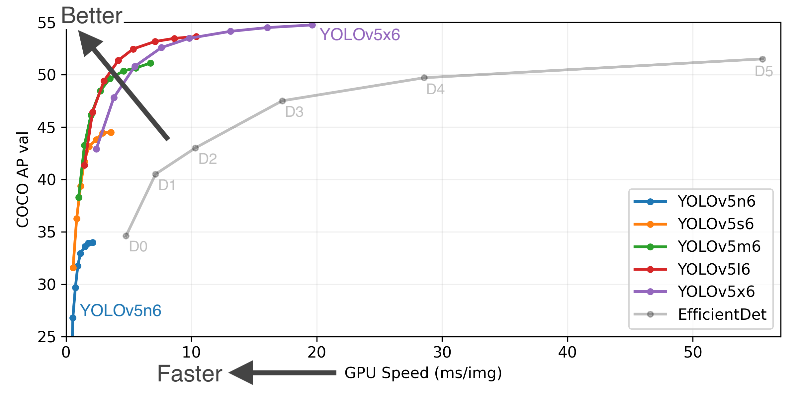
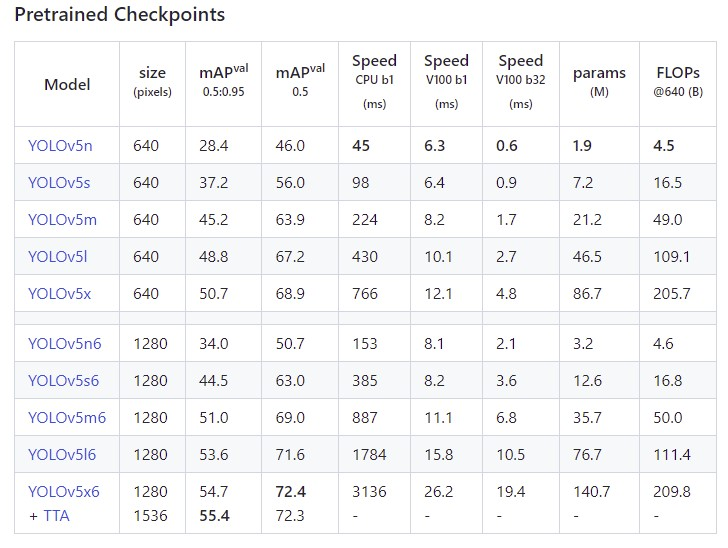

# yolov5demos

**YOLO - an acronym for 'You only look once'** - is an **object detection algorithm** that divides images into a grid system. Each cell in the grid is responsible for detecting objects within itself.

YOLO is one of the most famous object detection algorithms due to its speed and accuracy.**YOLOv5** has multiple varieties of pre-trained models as we can see below.  

The difference between them is the trade-off between **the size of the model**, **inference time** and **precision**. The lightweight model version **YOLOv5n6 is just a few MB** with **1.9M parameters** but not very accurate (mAP = 34). On the other side of the spectrum, we have **YOLOv5x6 whose size is much bigger** but is the most accurate version of its family (**140.7M parameters mAP > 54**).

https://github.com/ultralytics/yolov5/releases

03-Feb-2022

Serge Retkowsky | serge.retkowsky@microsoft.com | https://www.linkedin.com/in/serger/
